===========================
Software Architecture
===========================

The software consists of multiple tasks running in a **finite-state machine (FSM)**.
The main task is responsible for managing the state transitions and executing the appropriate actions.

Modules:

- `main.py` → Main execution loop

- `motor_control_task.py` → Motor control logic

- `line_sensor.py` → Sensor reading and processing

- `bno055.py` → IMU integration

- `bump_sensors.py` → Obstacle detection

- `pid_controller.py` → PID control algorithm

- `tasks.py` → Builds Tasks

Main.py
*******

This file contains the main function, as well as all of the testing functions we wrote for this project.
All of the functions have a default argument in them called in-run which is defaulted to False.
When the function is called, the function is called from the run function which contains the Try/Catch loop.
This reduces code duplication, improves readability, and reduces the overhead for writting new test functions.

**Tests**:
    For each peice of hardware, in general, three tests were written
        1. Tests the hardware's pyb assignments wiring, and data collection
        2. Tests the data collection, and centroid calculation
        3. Tests Romi's ability to find and follow a line.

please refer to the code in main.py for further details

Prelude.py
**********

This file contains globals that were helpful when programming.
In general everything in the prelude module would have been inlined at compile time,
but we did not see any performance improvements when they were 'Manually' inlined,
so were kept in that module thorughout development.

Tasks.py
********

This File contains all of the Tasks and Shares which is from (`https://github.com/spluttflob/ME405-Support`) support library

This file uses the builder pattern, and was written this way to allow for bug fixes found in testing files to be implimented
across all other instances of that task. I was tired of fixing or modifying a task and copying it all over the rest of the codebase.

I wish i was more able to control the share contruction and destructuring with better typing

Vehicle Control
***************
(`in motor_control_task.py`)

A lot of clock cycles for this project was saved by controlling when we run both the line sensor and the imu based on which 
vehicle control method was used. The state was passed using a share.
(`See source code for more information`)